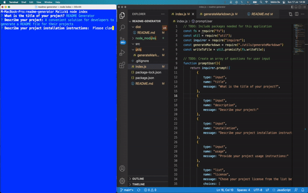

## README Generator

## Description
A convenient solution for developers to generate a README file for their projects. This is a command line application that dynamically generates a professional README.md file from a user's input using the Inquirer package.

## Table of Contents
- [Description](#description)
- [Installation](#installation)
- [Usage](#usage)
- [License](#license)
- [Contributors](#contributors)
- [Test](#test)

## Installation
Please clone this GitHub reposiroty and install Inquirer package. Inquirer installation instructions and details can be found at https://www.npmjs.com/package/inquirer

## Usage 
- Use `node index` in the command line to launch the application then follow the prompts. README.md file will be generated under the "dist" folder.
- A walkthough video can be found here: https://drive.google.com/file/d/1dPn6gGm62wG-LFsWywlb80cxLQFz-Q3N/view

## Screenshot of Generated README file code
The following image shows the generated README:

## License

## Contributors
Malick Ba, Software Engineer

## Test
No testing required

## More Projects
This README file was generated using the readme-generator. More of my projects are available on https://github.com/malickbax

